# Domain deep-dives

Each of the five domains is summarised below with a mind map, a concept-and-trap table, and the flow that ties it together. The weighting shows how many scored questions to expect, and therefore how much attention each domain earns in the sprint plan. The "exam trap" column is the wrong answer written to sound right, which is where a strong candidate loses marks.

---

## Domain 1: Agent architecture and orchestration (27%)

The heaviest domain, and the deepest gap for anyone whose background is prompting and skills rather than the Agent SDK. It is about the agent loop, delegating to specialist subagents, and controlling their behaviour with hooks and sessions.

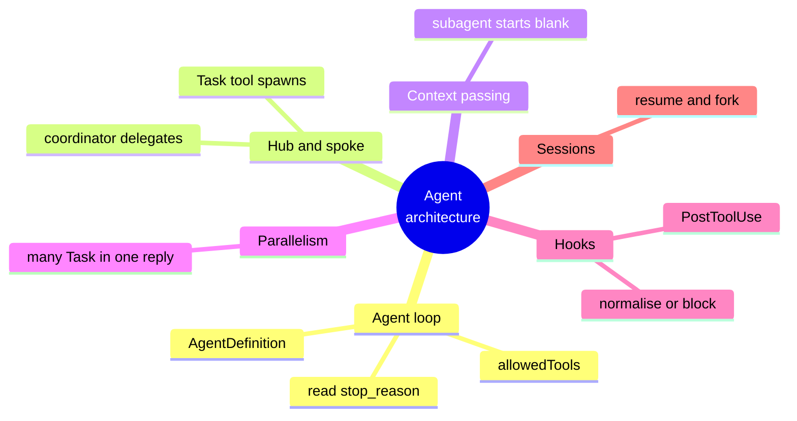

| Concept | One line | Exam trap |
| --- | --- | --- |
| Agent loop | The SDK sends, checks `stop_reason`, runs a tool, and repeats | Forgetting the loop ends on `end_turn` |
| Coordinator | One agent delegates to specialist subagents | — |
| Task tool | Spawns a subagent; the coordinator needs `Task` in its allowedTools | A coordinator without `Task` cannot delegate |
| Context passing | The subagent sees only its own prompt | Assuming it inherits the coordinator's chat history |
| Parallelism | Multiple Task calls in a single response run in parallel | Writing a sequential loop when asked to speed things up |
| Hooks | PostToolUse normalises output or blocks an action in code | Trusting the prompt to enforce policy |
| Sessions | `resume` continues a conversation, `fork_session` branches it | — |

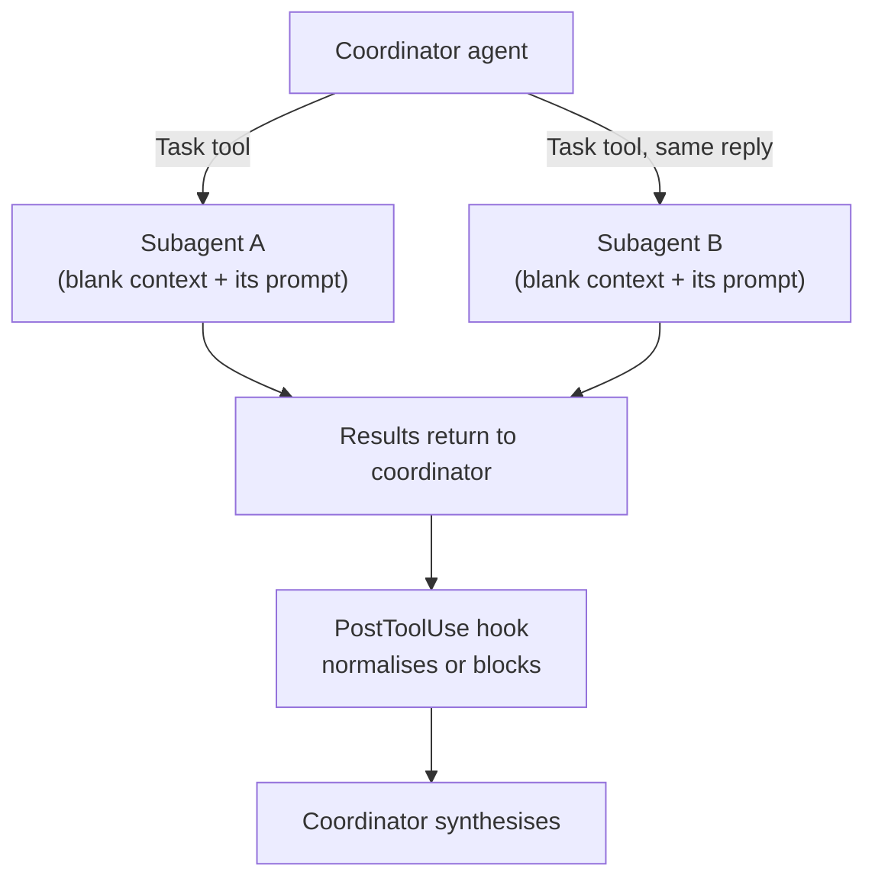

---

## Domain 2: Tool design and MCP integration (18%)

Building MCP servers is familiar ground for a practitioner. The scored gap is the quality patterns: descriptions that route correctly, and errors that an agent can act on.

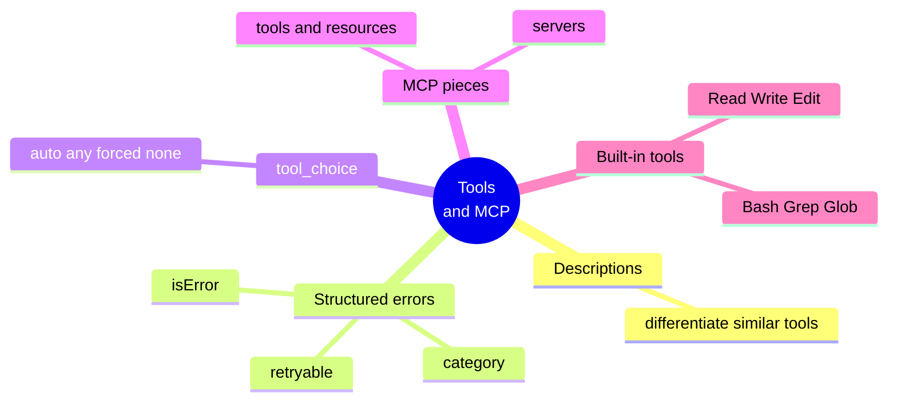

| Concept | One line | Exam trap |
| --- | --- | --- |
| Tool description | States when to use each of two similar tools, so routing is correct | Vague descriptions cause the wrong tool to be picked |
| Structured error | Returns `isError`, an error category, and whether it is retryable | Returning a bare "error 500" string the agent cannot reason about |
| tool_choice | Force a specific tool when the step demands an action | Leaving it on `auto` when the step must act |
| MCP config | Servers configured in `.mcp.json`, secrets supplied via environment variables | Committing tokens instead of using `${ENV_VAR}` |
| Built-in tools | Grep and Glob to explore, Edit only after a Read | Reaching for Edit before Read |

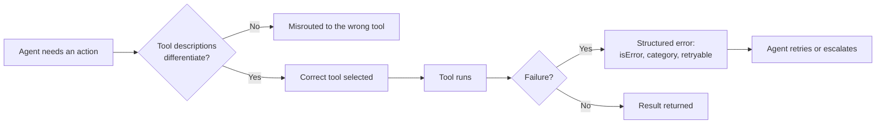

---

## Domain 3: Claude Code configuration and workflows (20%)

Authoring skills is daily practice, so this domain is mostly vocabulary and one real edge: driving Claude Code headless in CI.

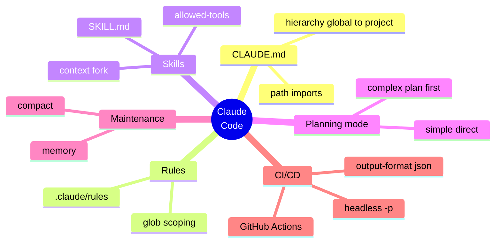

| Concept | One line | Exam trap |
| --- | --- | --- |
| CLAUDE.md hierarchy | Specific configuration overrides the general one | Getting the override direction backwards |
| Path-scoped rules | Rules load only for files matching their glob | Thinking every rule always loads |
| Skills | `context: fork` isolates a skill, `allowed-tools` limits it | — |
| Planning mode | Plan first for complex work, act directly for simple work | Planning everything, or planning nothing |
| CI/CD | Headless `-p` with `--output-format json` for pipelines | Tuning to catch everything rather than to cut false positives |

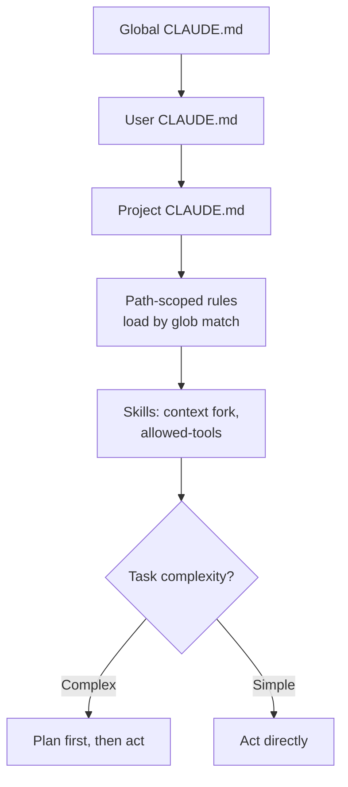

---

## Domain 4: Prompt engineering and structured output (20%)

A strength for anyone who grades work for a living. Two real gaps sit inside it: forcing JSON through a tool schema, and knowing when the Batch API applies.

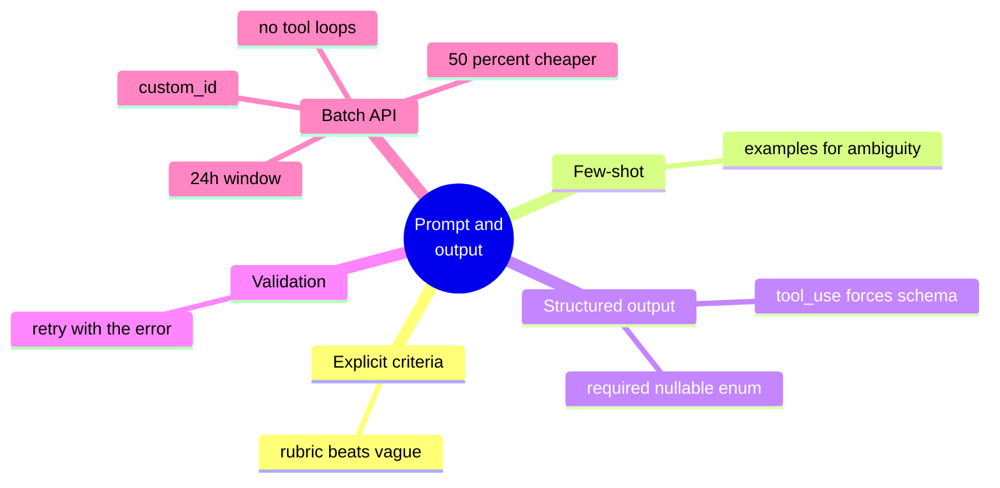

| Concept | One line | Exam trap |
| --- | --- | --- |
| Explicit criteria | A rubric outranks "review this" | — |
| Few-shot | Examples teach the ambiguous cases | — |
| Structured output | Force a tool whose schema is the exact output shape | Asking for JSON in prose instead of forcing a tool |
| Validation and retry | Send back the text, the bad answer, and the exact error | A blind re-ask that repeats the same mistake |
| Batch API | Cheap, up to 24 hours, uses `custom_id`, one-shot | Using it for interactive tool loops or blocking checks |

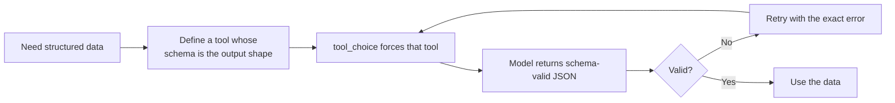

---

## Domain 5: Context management and reliability (15%)

The smallest domain, and one that reinforces Domain 1. It is about keeping the context window useful and failing gracefully.

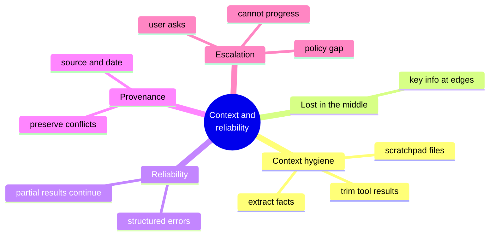

| Concept | One line | Exam trap |
| --- | --- | --- |
| Context hygiene | Extract facts, trim tool results, use scratchpad files | Letting long tool output fill the window |
| Lost in the middle | Put key information at the start and end of a long prompt | Burying instructions in the middle |
| Graceful failure | A subagent fails and the coordinator continues with partial results | One failure aborting the whole run |
| Provenance | Keep source and date, and preserve conflicts with attribution | Silently picking one of two conflicting values |
| Escalation | Escalate on a policy gap, an explicit request, or no progress | Guessing instead of asking a human |

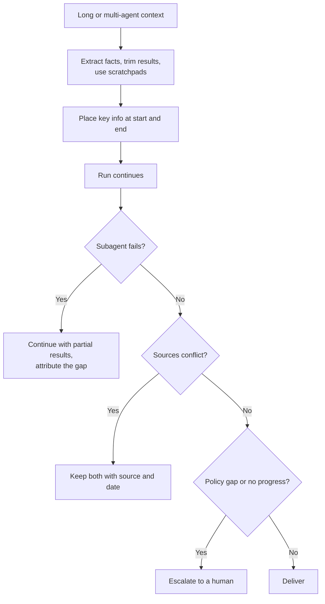

---

## Not on the exam

Time is wasted studying these. They are out of scope: fine-tuning, Constitutional AI and RLHF, API authentication and billing, hosting MCP servers, vector databases, Vision, streaming, computer use, prompt-caching internals, token counting, and cloud-specific setup.

---

## One picture for all five domains

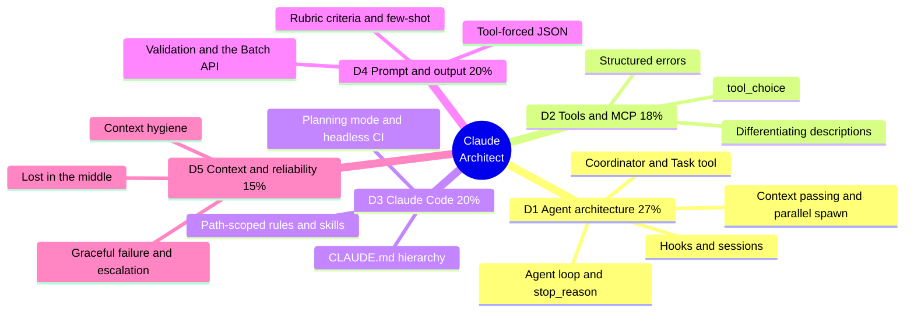
