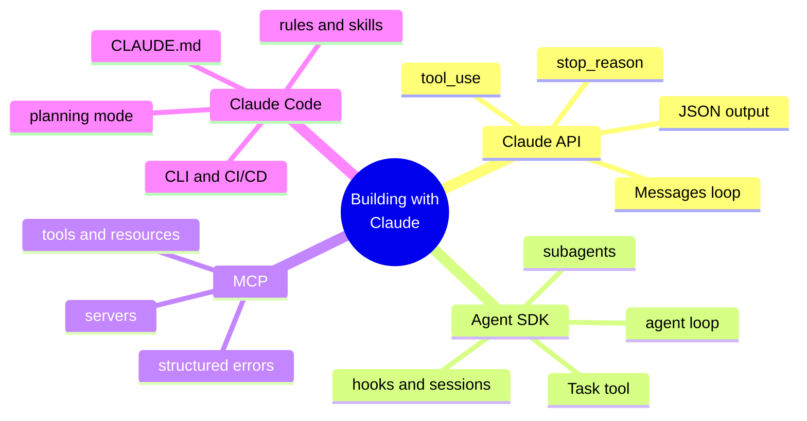
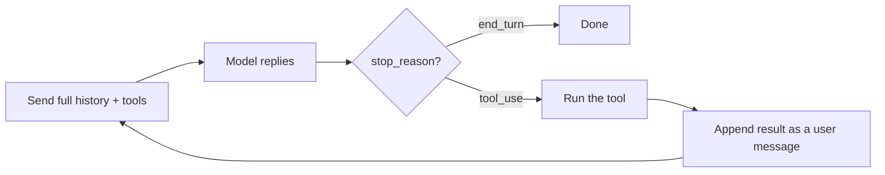
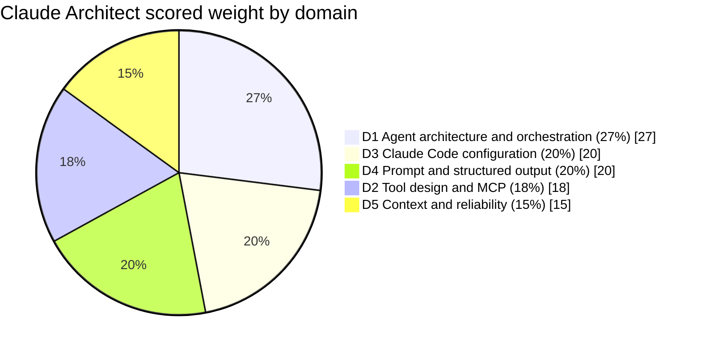

# Claude Certified Architect: Foundations

A practice-first study kit for the Claude Certified Architect (Foundations) exam. The credential confirms that a specialist can make sound trade-off decisions when building production Claude solutions across four core technologies: the Claude API, the Claude Agent SDK, the Model Context Protocol (MCP), and Claude Code.

The kit is built for someone who already authors skills, builds MCP servers, and writes evaluation logic, and who needs to convert that hands-on experience into a passing score. The sequencing follows the skills gap rather than the domain numbers, so the heaviest and least familiar domain leads.

## Exam facts at a glance

| Attribute | Detail |
| --- | --- |
| Credential | Claude Certified Architect: Foundations |
| Maintained by | Anthropic |
| Technologies assessed | Claude API, Claude Agent SDK, Model Context Protocol (MCP), Claude Code |
| Question type | Multiple choice, one correct answer of four |
| Scoring | 100 to 1000 scale |
| Passing score | 720 (a score of 720 or greater passes) |
| Guessing penalty | None, so every question should be answered |
| Scenario structure | Four of eight possible scenarios, randomly selected |
| Question style | Realistic industry scenarios (customer support agents, multi-agent research, CI/CD integration, structured extraction) |
| Recommended experience | Around six months hands-on with the Agent SDK, Claude Code, MCP, and prompt engineering |

## The four technologies in one line

The API is the raw conversation. The Agent SDK wraps it in a tool-calling loop that can delegate. MCP plugs in the backend. Claude Code is the ready-made agent configured with files.

## The API loop (learn this before anything else)

Every agent behaviour on the exam is built on one loop. The API is stateless, so the whole message history is resent each call. The model replies, the code inspects `stop_reason`, and either finishes or runs a tool and appends the result.

## What the exam measures

Five domains. The percentages are the published share of scored questions, which drives how the sprint plan allocates time.

## Pages in this kit

| Page | Purpose |
| --- | --- |
| [Two-week sprint plan]({{ site.baseurl }}/claude-certified-architect/plan/) | Gap-ordered sprint, heaviest and least familiar domain first |
| [Domain deep-dives]({{ site.baseurl }}/claude-certified-architect/domains/) | Each of the five domains with a diagram, the key concepts, and the exam traps |
| [Practice and flashcards]({{ site.baseurl }}/claude-certified-architect/practice/) | A self-test bank organised by domain, plus rapid-recall flashcards |
| [Resources]({{ site.baseurl }}/claude-certified-architect/resources/) | Official Anthropic courses and documentation for each technology |
