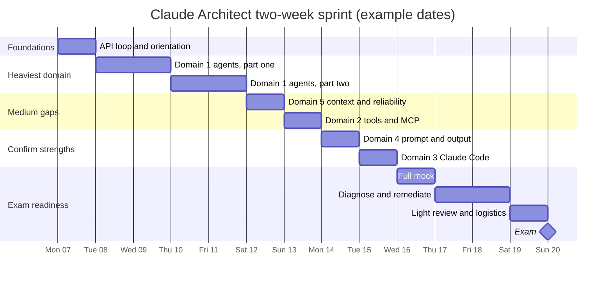
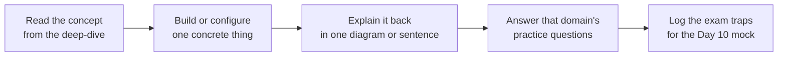

# Two-week sprint plan

A fourteen-day plan that assumes roughly one to two hours on weekdays and a longer build on each weekend. The days are numbered rather than dated, so the plan works from whatever start date the sitting requires. Count backwards from the exam so Day 14 lands on exam day.

The one rule that shapes everything: order follows the skills gap, not the domain numbers. Domain 1 is both the heaviest weight and, for someone strong in prompting and Claude Code, the least familiar, so it leads and takes the largest block. The strong domains are confirmed with practice questions rather than re-studied.

## How the sprint is shaped

The dates below are an illustrative fortnight starting on a Monday. Substitute the real dates for the chosen sitting, keeping the same shape, so the mock still lands three days before the exam.

## Where the hours go

Time is allocated against the domain weight and the size of the gap together, not spread evenly. Domain 1 carries the largest weight and the deepest gap, so it earns four days.

| Domain | Weight | Days | Rationale |
| --- | --- | --- | --- |
| 1. Agent architecture and orchestration | 27% | 4 | Heaviest weight and, for a skills-and-prompting background, the deepest gap. The Agent SDK loop, subagents, hooks, and sessions are new |
| 5. Context management and reliability | 15% | 1 | A medium gap that reinforces Domain 1, so it follows immediately |
| 2. Tool design and MCP integration | 18% | 1 | Familiar mechanics (building MCP), but the quality patterns (structured errors, tool_choice) are the gap |
| 4. Prompt engineering and structured output | 20% | 1 | A strength. Confirm only, with two real gaps: tool-forced JSON and the Batch API |
| 3. Claude Code configuration and workflows | 20% | 1 | A strength (authoring skills). Confirm the vocabulary and the CI edge |
| Mock, diagnosis, remediation | n/a | 3 | The highest-value block in the plan |

## The daily schedule

| Day | Focus | Output that closes the day |
| --- | --- | --- |
| Day 1 | The API loop. Send a full message history, read `stop_reason`, run a tool, append the result, repeat. Skim the *Building with the Claude API* course | The stateless loop drawn from memory |
| Day 2 | Domain 1, part one: the Agent SDK loop, `AgentDefinition`, `allowedTools`, and the coordinator that delegates to specialist subagents through the Task tool | An agent loop that calls one tool and stops on `end_turn` |
| Day 3 | Domain 1, part one continued: context passing (a subagent starts blank) and parallel spawn (many Task calls in one reply) | A coordinator that spawns two subagents in parallel |
| Day 4 | Domain 1, part two: hooks (PostToolUse to normalise or block) and sessions (resume and fork). Build a small multi-agent research flow | One hook that blocks a disallowed action |
| Day 5 | Domain 1, part two continued: finish the multi-agent build and answer every Domain 1 practice question | Domain 1 practice questions answered |
| Day 6 | Domain 5: context hygiene, lost-in-the-middle, graceful failure with partial results, provenance, and escalation by rule | Domain 5 practice questions answered |
| Day 7 | Domain 2: tool descriptions that differentiate similar tools, structured errors (`isError`, category, retryable), tool_choice, and built-in tools. Skim *Introduction to MCP* | A structured error object designed for one tool |
| Day 8 | Domain 4: force JSON with a tool schema (not prose), validate and retry by feeding the exact error back, and the Batch API rule (fifty percent cheaper, up to 24 hours, `custom_id`, no tool loops) | Domain 4 practice questions answered |
| Day 9 | Domain 3: CLAUDE.md hierarchy, path-scoped rules, skills (`context: fork`, allowed-tools), planning mode, and headless CI (`-p`, `--output-format json`). Skim *Claude Code in Action* | Domain 3 practice questions answered |
| Day 10 | Timed full mock under exam conditions. Score it and bucket every miss by domain | A scored mock with misses tagged by domain |
| Day 11 | Remediate the two weakest domains from the mock. Re-read their deep-dives and re-answer their questions | Two remediated domains |
| Day 12 | Remediate the next weakest domain and drill all flashcards until every prompt is instant | Every flashcard recalled without hesitation |
| Day 13 | Light review only. Re-skim all five deep-dives and every exam-trap row. No new material | The five-domain mind map drawn from memory |
| Day 14 | Exam. Answer every question because there is no guessing penalty | |

## Three rules that matter more than the schedule

1. **Building beats reading for Domain 1.** Reading about the agent loop will not pass this exam. The weekend builds on Days 4 and 5 are where the heaviest domain is actually learned, so protect them first.
2. **The Day 10 mock is not optional.** The strong domains make the exam feel easy, but the wrong answers are written to sound right. A mock exposes that trap before exam day rather than during it.
3. **Confirm strengths, do not over-study them.** Domains 3 and 4 are existing daily practice. One focused day each, spent on the specific gaps (tool-forced JSON, the Batch API, headless CI), beats re-reading what is already known.

## Daily rhythm

## Contingency if a day is lost

Should a day be lost, protect the order below and drop from the bottom. The mock survives in every scenario, because an unmeasured gap is more dangerous than an unstudied strong domain.

1. Day 10 mock and remediation
2. Domain 1 (Days 2 to 5)
3. Domain 5, then Domain 2
4. Domain 4 and Domain 3 (confirm with questions only)

## If only three or four days a week are available

Stretch the same order across five or six weeks rather than compressing it. Do not drop the builds. A slower plan that keeps the weekend builds beats a fast plan that replaces them with reading.
