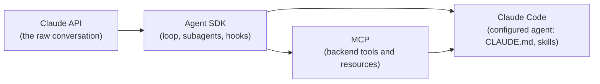

# Resources

Every source below is either first-party (Anthropic) or the official specification for a technology the exam assesses. The Anthropic courses together cover the four technologies and are the single most efficient study path.

## Official Anthropic courses (the core study path)

These free, self-paced courses map to the exam domains. One course per week fits the two-week sprint if two are paired.

| Course | Maps to |
| --- | --- |
| [Building with the Claude API](https://anthropic.skilljar.com/claude-with-the-anthropic-api) | The API loop, tool use, and structured output (Domains 1 and 4) |
| [Introduction to Model Context Protocol](https://anthropic.skilljar.com/introduction-to-model-context-protocol) | Tool design and MCP integration (Domain 2) |
| [Claude Code in Action](https://anthropic.skilljar.com/claude-code-in-action) | Claude Code configuration and workflows (Domain 3) |
| [Introduction to Agent Skills](https://anthropic.skilljar.com/introduction-to-agent-skills) | Skills vocabulary within Claude Code (Domain 3) |

## Official documentation (deepen specific domains)

| Topic | Source |
| --- | --- |
| Claude Agent SDK | [Agent SDK documentation](https://docs.anthropic.com/en/api/agent-sdk/overview) |
| Claude API messages and tool use | [Tool use with the Messages API](https://docs.anthropic.com/en/docs/build-with-claude/tool-use) |
| Structured output via tools | [Tool use for structured output](https://docs.anthropic.com/en/docs/build-with-claude/tool-use) |
| Message Batches API | [Message Batches](https://docs.anthropic.com/en/docs/build-with-claude/batch-processing) |
| Claude Code and CLAUDE.md | [Claude Code documentation](https://docs.anthropic.com/en/docs/claude-code/overview) |
| Model Context Protocol | [MCP specification](https://modelcontextprotocol.io/) |

## How the pieces fit

## Exam logistics worth acting on early

1. Confirm the working environment before study starts: a current Claude Code install and a working API key, so the practice builds are not blocked on setup.
2. Because there is no guessing penalty, plan to answer every question. Flag and revisit uncertain ones, but never leave a blank.
3. The exam rewards trade-off judgement in realistic scenarios, not recall of definitions. Every study day should close with something built or a scenario reasoned through, not just reading.

## A note on third-party materials

Community-maintained practice tests and reference PDFs exist for this certification. Treat them as supplements only, verify their claims against the official Anthropic documentation above, and do not rely on any single third-party question bank as authoritative.
