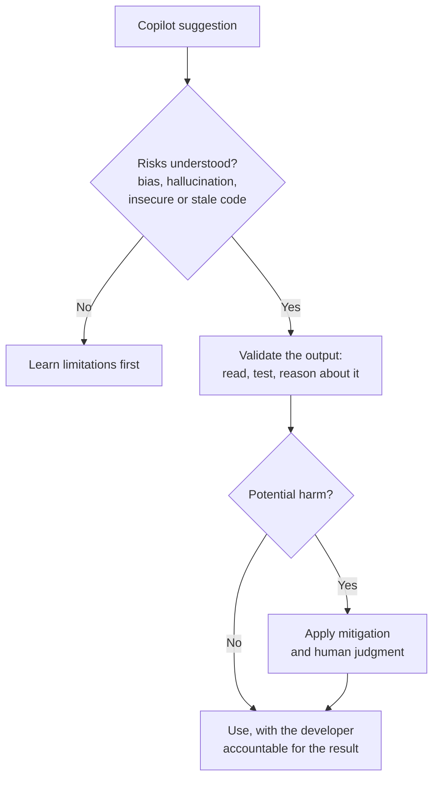
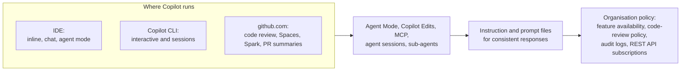
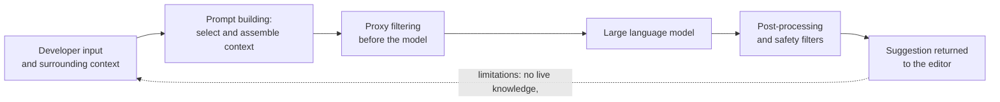
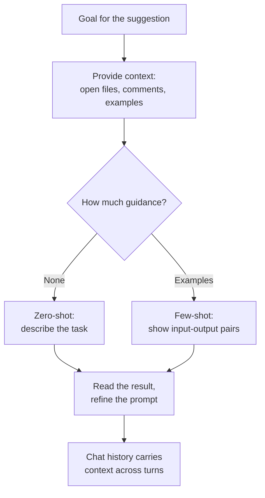
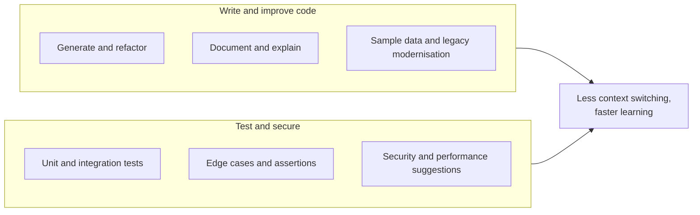
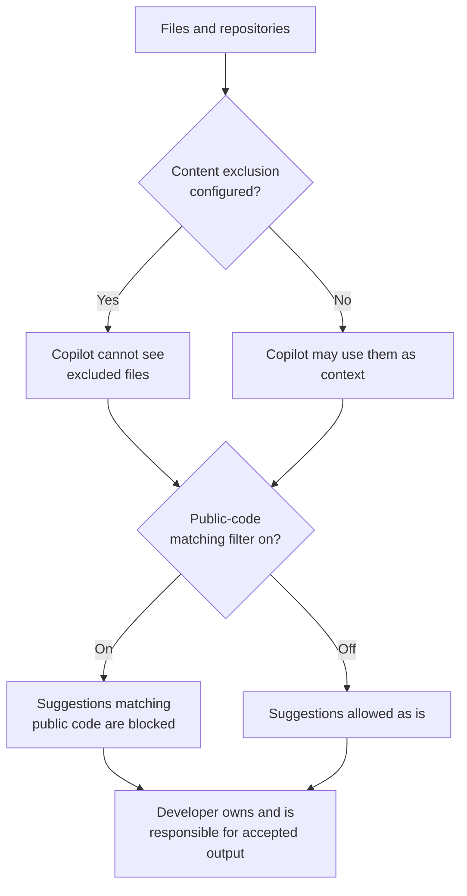
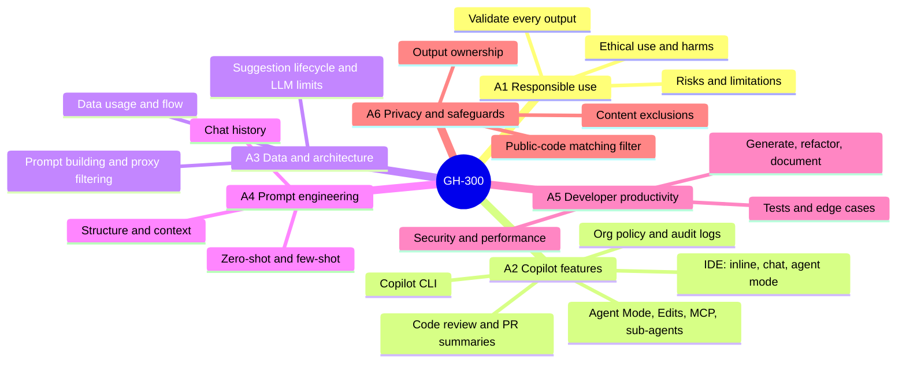

# Domain deep-dives

Each of the six skill areas is summarised below with the skills the study guide lists and a diagram that shows the flow. The weighting shows how many scored questions to expect, and therefore how much attention each area earns in the sprint plan.

---

## Area 1: Use GitHub Copilot responsibly (15-20%)

The conceptual foundation. It is about knowing what generative AI can and cannot be trusted to do, the harms it can cause, and why a developer stays accountable for every suggestion accepted.

Skills to master:

| Skill area | What it covers |
| --- | --- |
| Responsible AI principles | Describe the risks and limitations of generative AI tools, describe ethical and responsible use, and identify potential harms and mitigation strategies |
| Validate and operate | Explain why AI output must always be validated, and identify how to operate Copilot responsibly |

---

## Area 2: Use GitHub Copilot features (25-30%)

The heaviest-scored area, and the most hands-on. It spans the IDE, the CLI, the newer agentic features, code review, and the organisation-wide settings an administrator controls.

Skills to master:

| Skill area | What it covers |
| --- | --- |
| Copilot in the IDE | Enable Copilot, trigger it through inline suggestions, chat, CLI, and agent mode, and configure content exclusions for files or repositories |
| Copilot CLI | Define what the CLI is and its benefits, install it, use it interactively and in sessions, and generate scripts and manage files with it |
| Features and capabilities | Use Agent Mode, Copilot Edits, and MCP, manage agent sessions and sub-agents, use Copilot for code review, and use Spaces, Spark, pull request summaries, and instruction files |
| Organisation settings and policies | Configure organisation-wide policy, enable Copilot Code Review policies, manage feature availability, use audit log events, and manage subscriptions with the REST API |

---

## Area 3: Understand GitHub Copilot data and architecture (10-15%)

The one area that is pure knowledge rather than hands-on. It traces what happens to a prompt between the editor and the model, and back again.

Skills to master:

| Skill area | What it covers |
| --- | --- |
| Data handling and flow | Explain data usage, flow, and sharing, describe input processing and prompt building, and explain proxy filtering and post-processing |
| Lifecycle and limitations | Visualise the code-suggestion lifecycle, and describe the limitations of large language models and of Copilot |

---

## Area 4: Apply prompt engineering and context crafting (10-15%)

How to shape the input so the suggestion is useful. This area rewards the instinct for giving the model the right context rather than more words.

Skills to master:

| Skill area | What it covers |
| --- | --- |
| Craft effective prompts | Describe prompt structure and context, understand how context is determined, use zero-shot and few-shot prompting, and apply prompt-crafting best practices |
| Engineer for performance | Explain prompt engineering principles, and describe the prompt process flow and how chat history is used |

---

## Area 5: Improve developer productivity with GitHub Copilot (10-15%)

The everyday use cases: writing, refactoring, documenting, testing, and hardening code faster, with less context switching.

Skills to master:

| Skill area | What it covers |
| --- | --- |
| Productivity and code quality | Use Copilot for code generation, refactoring, and documentation, accelerate learning and reduce context switching, and generate sample data and modernise legacy code |
| Testing and security | Generate unit and integration tests, identify edge cases and write assertions, and suggest security improvements and performance optimisations |

---

## Area 6: Configure privacy, content exclusions, and safeguards (10-15%)

The administrative controls that keep Copilot from touching what it should not, and the filters that protect output.

Skills to master:

| Skill area | What it covers |
| --- | --- |
| Privacy settings and exclusions | Configure content exclusions and editor settings, and describe the ownership and limitations of outputs |
| Safeguards and troubleshooting | Enable the filter for suggestions matching public code, and resolve issues with suggestions and content exclusions |

---

## One picture for all six areas

