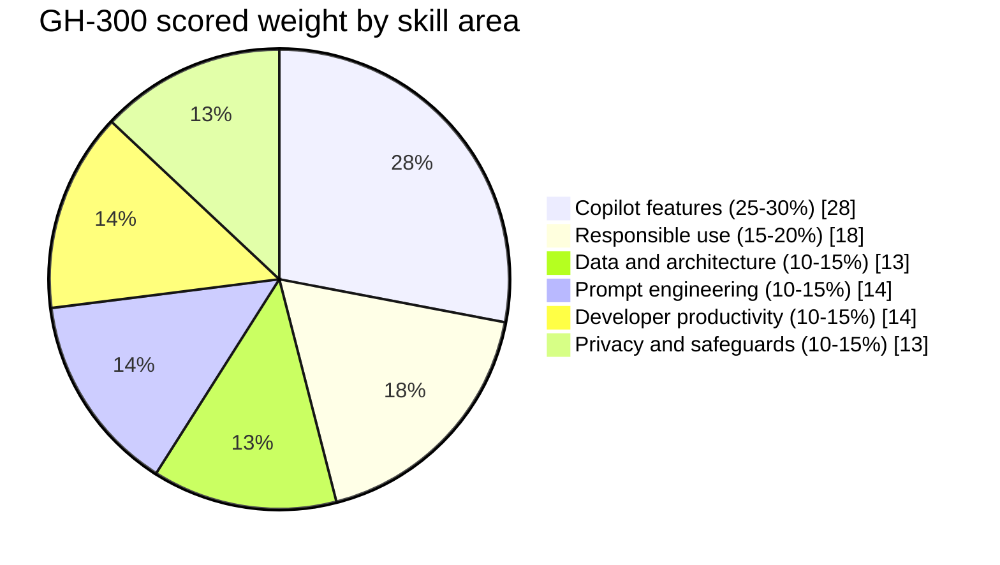
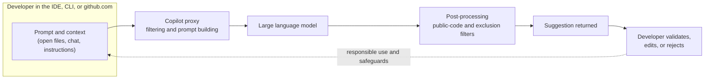

# GH-300: GitHub Copilot

A practice-first study kit for Exam GH-300, the exam behind the GitHub Copilot certification. The kit is built for someone who already uses Copilot day to day in the IDE and on github.com, and who wants to convert that hands-on experience into a passing score inside two weeks.

## Exam facts at a glance

| Attribute | Detail |
| --- | --- |
| Exam code | GH-300 |
| Credential | GitHub Copilot |
| Level | Intermediate |
| Maintained by | GitHub, delivered by Microsoft through Pearson VUE |
| Format | Proctored, multiple choice, may include interactive components |
| Duration | Approximately 90 minutes |
| Passing score | 700 (a score of 700 or greater passes) |
| Status | Generally available (not beta), so scores return immediately |
| Language | English (other languages updated roughly eight weeks after the English version) |
| Skills measured as of | 7 August 2026 |
| Scheduling | Personal Microsoft account (MSA) strongly recommended, so records survive a job change |

## What the exam measures

The exam is split into six skill areas. The percentages are the published share of scored questions, which drives how the sprint plan allocates time.

The mental model that ties the six areas together is a single suggestion travelling from the editor, through Copilot's proxy and filters, back to the developer, who stays responsible for validating what returns.

Read the plan next, then work through the domain deep-dives.

## Pages in this kit

| Page | Purpose |
| --- | --- |
| [Two-week sprint plan]({{ site.baseurl }}/gh-300-github-copilot/plan/) | Day-by-day plan across fourteen days, weighted to the scored skill areas |
| [Domain deep-dives]({{ site.baseurl }}/gh-300-github-copilot/domains/) | Each of the six skill areas explained with a diagram and the key skills |
| [Practice and flashcards]({{ site.baseurl }}/gh-300-github-copilot/practice/) | A self-test bank organised by skill area, plus rapid-recall flashcards |
| [Resources]({{ site.baseurl }}/gh-300-github-copilot/resources/) | Official study guide, training paths, and supporting documentation |
