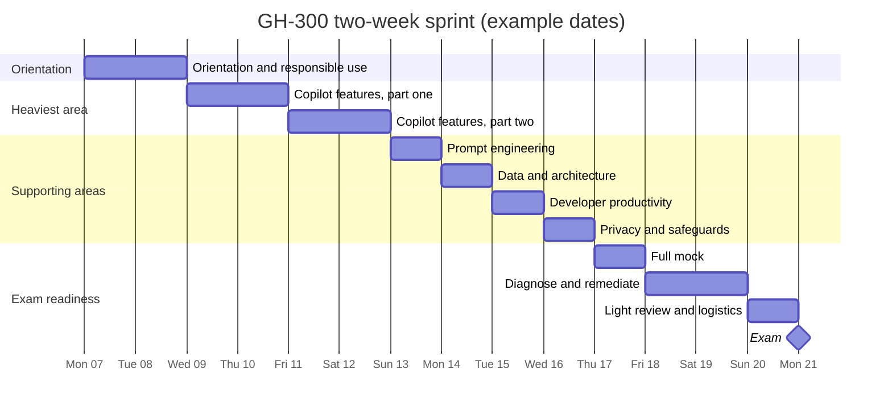
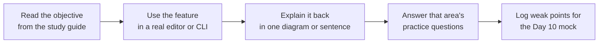

# Two-week sprint plan

A fourteen-day plan that assumes roughly one to two hours on weekdays and a longer block on each weekend. The sequencing rule is the same one the GH-600 kit uses: hours follow exam weight, and the heaviest area gets the largest block. The days are numbered rather than dated, so the plan works from whatever start date the exam sitting requires. Count backwards from the exam: Day 14 should land on the exam day.

## How the sprint is shaped

The dates below are an illustrative fortnight starting on a Monday. Substitute the real dates for the chosen sitting, keeping the same shape, so the mock still lands four days before the exam.

## Where the hours go

Time is allocated against the published skill weights rather than spread evenly. The Copilot features area carries the largest share of scored questions and earns four days.

| Skill area | Weight | Days | Rationale |
| --- | --- | --- | --- |
| 2. Use GitHub Copilot features | 25-30% | 4 | Heaviest scored area, and the one closest to daily IDE, CLI, and github.com practice |
| 1. Use GitHub Copilot responsibly | 15-20% | 1.5 | Second heaviest, and quick to lock in because it is conceptual |
| 4. Apply prompt engineering | 10-15% | 1 | Reinforces features and productivity, so it sits between them |
| 3. Data and architecture | 10-15% | 1 | The one area that is pure knowledge rather than hands-on |
| 5. Improve developer productivity | 10-15% | 1 | Use cases that overlap heavily with everyday work |
| 6. Privacy, exclusions, safeguards | 10-15% | 1 | Admin-flavoured, so it pairs with organisation settings |
| Mock, diagnosis, remediation | n/a | 3 | The highest-value block in the plan |

## The daily schedule

| Day | Focus | Output that closes the day |
| --- | --- | --- |
| Day 1 | Orientation. Read the study guide end to end. Launch the exam sandbox to see the question interface. Skim *GitHub Copilot Fundamentals Part 1* | The suggestion lifecycle drawn from memory |
| Day 2 | Responsible use in full: risks and limitations of generative AI, ethical use, potential harms and mitigations, and why AI output must be validated | Every responsible-use practice question answered |
| Day 3 | Copilot features, part one: enable Copilot in the IDE, inline suggestions, chat, CLI, and agent mode. Install and use the Copilot CLI | Copilot CLI installed and one script generated with it |
| Day 4 | Copilot features, part two: Agent Mode, Copilot Edits, MCP, agent sessions, sub-agents, code review, Spaces, Spark, pull request summaries, and instruction files | One instructions file written and one pull request summary generated |
| Day 5 | Organisation settings: policy management, Copilot Code Review policies, feature availability across IDEs and github.com, audit log events, and subscription management via REST API | Copilot features practice questions answered |
| Day 6 | Prompt engineering: prompt structure and context, how context is determined, zero-shot and few-shot prompting, and prompt process flow with chat history | A before-and-after prompt rewrite showing better context |
| Day 7 | Data and architecture: data usage, flow, and sharing, input processing and prompt building, proxy filtering and post-processing, and LLM limitations | The data-flow diagram redrawn from memory |
| Day 8 | Developer productivity: code generation, refactoring, documentation, sample data, legacy modernisation, unit and integration tests, edge cases, and security suggestions | Productivity practice questions answered |
| Day 9 | Privacy and safeguards: content exclusions, editor settings, output ownership and limits, public-code matching filter, and troubleshooting suggestions and exclusions | A content-exclusion rule configured and tested |
| Day 10 | Timed full mock under exam conditions. Score it and bucket every miss by skill area | A scored mock with misses tagged by area |
| Day 11 | Remediate the two weakest areas from the mock. Re-read their deep-dives and re-answer their questions | Two remediated areas |
| Day 12 | Remediate the next weakest area and drill all flashcards until every prompt is instant | Every flashcard recalled without hesitation |
| Day 13 | Light review only. Re-skim all six deep-dives and the exam facts. No new material | The full six-area mind map drawn from memory |
| Day 14 | Exam. Identity document ready and matching the Learn profile legal name. Online proctoring pre-check completed on the actual machine and network | |

## Three rules that matter more than the schedule

1. **Features is the exam, so it gets the most days.** One area alone is a quarter to a third of the score. Days 3 to 5 are where the exam is won or lost, so protect them first.
2. **The Day 10 mock is not optional.** Two weeks is enough time to fix two or three weak areas, but only if they are found before exam day rather than during it. Diagnose first, remediate second.
3. **No session ends on reading alone.** Each day closes with something built, drawn, or answered, because the exam rewards operating Copilot rather than reciting definitions.

## Daily rhythm

## Contingency if a day is lost

Should a day be lost, protect the order below and drop from the bottom. The mock survives in every scenario, because an unmeasured gap is more dangerous than an unstudied light area.

1. Day 10 mock and remediation
2. Copilot features (Days 3 to 5)
3. Responsible use (Day 2)
4. Prompt engineering and productivity
5. Data and architecture, then privacy and safeguards
