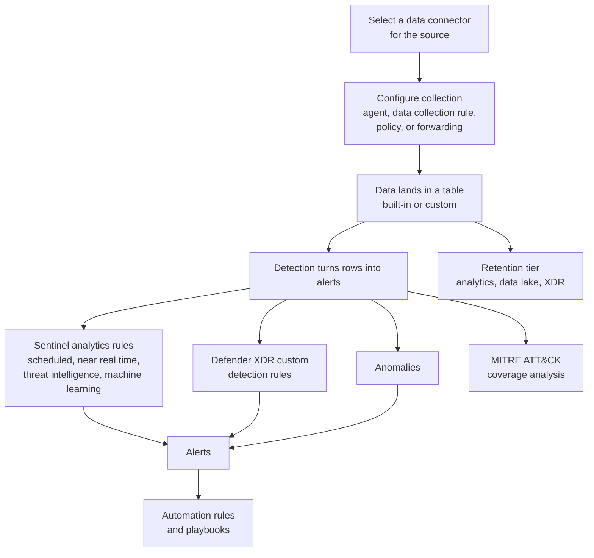
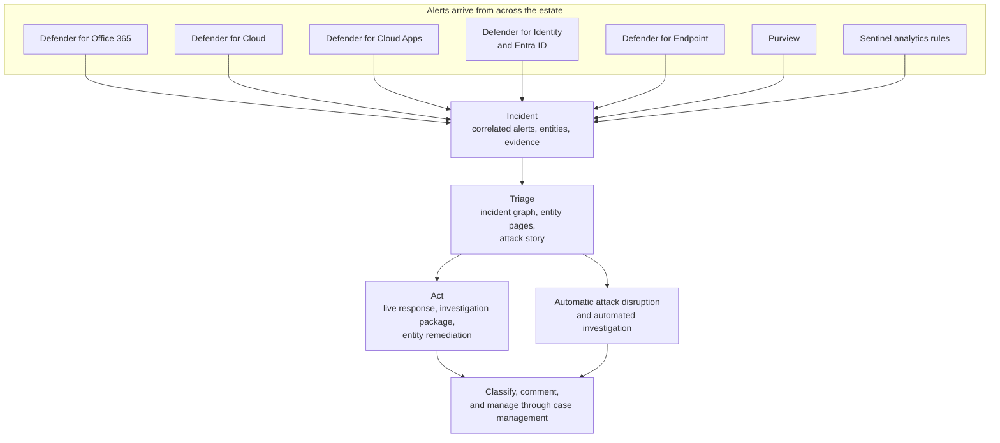
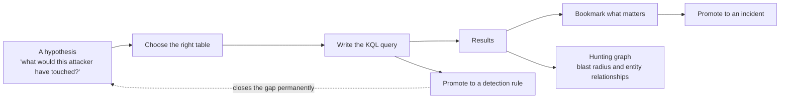

# Domain deep-dives

The three skill areas, each with the flow that explains it, the skills the exam measures, and labs to execute in a lab tenant. Objectives reflect the skills measured document dated 16 April 2026. Confirm against the [official study guide](https://learn.microsoft.com/en-us/credentials/certifications/exams/sc-200/) before sitting, because Microsoft revises the list periodically.

A note on the labs: every step assumes a tenant that is safe to change. Do not run these against a production environment. Portal paths and user interface labels shift, so treat the navigation as a strong hint rather than an exact script.

---

## Domain 1: Manage a security operations environment

Weight: 40 to 45 percent. The largest domain, and the one that rewards portal familiarity most.



### Configure automation for Defender XDR and Sentinel

1. Configure email notifications in Defender XDR for incidents, actions, and threat analytics.
2. Configure alert notifications in Defender XDR, including tuning, suppression, and correlation.
3. Configure Defender for Endpoint advanced features.
4. Configure rules settings in Defender for Endpoint.
5. Configure custom data collection in Defender for Endpoint.
6. Configure security policies for Defender for Endpoint, including attack surface reduction rules.
7. Manage automated investigation and response capabilities in Defender XDR.
8. Configure automatic attack disruption in Defender XDR.
9. Configure and manage device groups, permissions, and automation levels in Defender for Endpoint.
10. Create and configure automation rules in Sentinel.
11. Create and configure Sentinel playbooks.

### Configure the Sentinel SIEM and platform

1. Specify Sentinel roles.
2. Manage data retention for XDR and Sentinel tables across the analytics, data lake, and XDR tiers.
3. Create and configure Sentinel workbooks.
4. Optimise the Sentinel platform using SOC optimisation recommendations.

### Ingest data into the Sentinel SIEM and platform

1. Select data connectors based on data source requirements.
2. Configure Windows security events through the Azure Monitor Agent using data collection rules.
3. Plan and configure Windows security events through Windows Event Forwarding.
4. Plan and configure Syslog and CEF connectors through the Azure Monitor Agent.
5. Configure Azure activity collection through Azure Policy and resource diagnostic settings.
6. Ingest threat indicators into Sentinel.
7. Create custom log tables in the workspace to store ingested data.

### Configure detections

1. Create custom detection rules through advanced hunting in Defender XDR.
2. Manage custom detection rules in Defender XDR.
3. Configure and manage analytics rules in Sentinel: scheduled, near real time, threat intelligence, and machine learning.
4. Analyse attack vector coverage using the MITRE ATT&CK matrix.
5. Configure anomalies in Sentinel.

### Labs

#### Lab 1.1: Defender XDR automation

1. In the Defender portal, open Settings, then Email and collaboration, then Notifications. Create an email notification policy for high-severity incidents.
2. Open Settings, then Endpoints, then Advanced features. Enable automated investigation.
3. Open Settings, then Endpoints, then Rules. Create a custom indicator using a file hash, an IP address, or a URL.
4. Open Settings, then Endpoints, then Device groups. Create a test device group and set a specific automation level on it.
5. Verify the configuration by triggering a test alert and confirming the automated response fires.

#### Lab 1.2: Sentinel platform configuration

1. Open Sentinel and select the workspace.
2. Review role assignments through access control, and confirm which Sentinel role is held.
3. Configure data retention for different table tiers, and note how the analytics tier differs from the data lake tier.
4. Create a workbook containing a query that shows sign-in failures over the last seven days.
5. Open SOC optimisation from the overview page, review the recommendations, and action at least one.

#### Lab 1.3: Ingest data into Sentinel

1. Open Sentinel, then Data connectors.
2. Connect Windows Security Events through the Azure Monitor Agent. Create a data collection rule and select all security events.
3. Connect Azure Activity, configured through Azure Policy so diagnostic settings deploy automatically.
4. Open Threat intelligence and upload a sample indicator, such as an IP address or a domain, manually.
5. Create a custom log table: open Tables, create a table based on a data collection rule, define a schema, and ingest test data.
6. Verify the result by running a query against each connected table to confirm data is arriving.

#### Lab 1.4: Configure detections

1. In the Defender portal, open Hunting, then Advanced hunting.
2. Write a query that surfaces failed sign-ins grouped by account and location:

   ```kusto
   IdentityLogonEvents
   | where ActionType == "LogonFailed"
   | summarize FailureCount = count() by AccountUpn, Location
   | sort by FailureCount desc
   ```

3. Save the query as a custom detection rule running on a daily frequency.
4. In Sentinel, open Analytics and create a scheduled rule that counts failed logon events:

   ```kusto
   SecurityEvent
   | where EventID == 4625
   | summarize FailureCount = count() by TargetAccount
   ```

   Run it every five minutes with a five-minute lookback.
5. Create a near real time rule for high-severity events, and note the constraints that distinguish it from a scheduled rule.
6. Open the MITRE ATT&CK view, review current detection coverage, and identify the gaps.
7. Open Anomalies, enable at least two built-in anomaly rules, and review their thresholds.

---

## Domain 2: Respond to security incidents

Weight: 35 to 40 percent. Largely about knowing which product owns which signal, and what actions are available once an entity is identified.



### Respond to alerts and incidents in Defender XDR

1. Investigate and remediate threats through Defender for Office 365, including automatic attack disruption.
2. Investigate and remediate threats or compromised entities identified by Purview.
3. Investigate and remediate alerts from Defender for Cloud workload protections.
4. Investigate and remediate security risks from Defender for Cloud Apps.
5. Investigate and remediate compromised identities from Entra ID.
6. Investigate and remediate security alerts from Defender for Identity.
7. Investigate and remediate alerts and incidents identified by Sentinel.
8. Investigate incidents using agentic assistance, including embedded Security Copilot.
9. Investigate complex attacks that are multi-stage, multi-domain, or involve lateral movement.
10. Manage security incidents using case management.

### Respond to alerts and incidents in Defender for Endpoint

1. Investigate device timelines.
2. Perform actions on a device, including live response and collecting investigation packages.
3. Perform evidence and entity investigation.
4. Investigate and remediate incidents raised by automatic attack disruption.

### Investigate Microsoft 365 activities to identify threats

1. Investigate threats using Audit in Purview.
2. Investigate threats using Content Search in Purview.
3. Investigate threats using Microsoft Graph activity logs.

### Labs

#### Lab 2.1: Investigate in Defender XDR

1. In the Defender portal, open Incidents and alerts, then Incidents, and select an active or test incident.
2. Work the incident properly: review the incident graph to identify entities, evidence, and the attack story. Open each entity page and read its timeline. Check whether automatic attack disruption already acted. Classify the incident and add a comment.
3. Open the Action center and review both pending and completed actions.
4. If Security Copilot is available, open it from within the incident and ask it to summarise the incident and recommend next steps. Then verify its answer against the evidence, because validating machine output is itself an exam theme.
5. Practise linking related incidents, which is how multi-stage attacks are handled.

#### Lab 2.2: Defender for Endpoint deep dive

1. Open Assets, then Devices, and select a test device.
2. Review the device timeline, filtering by process, network, and file events in turn.
3. Start a live response session. Connect to the device, list running processes, retrieve a file from a temporary directory to practise collection, then disconnect.
4. From an alert on that device, collect an investigation package.
5. Review the automated investigation results for the device and note what was remediated without analyst input.

#### Lab 2.3: Microsoft 365 investigation

1. In the Purview portal, open Audit and search for all Exchange activity in the last twenty-four hours, then for file access events in SharePoint.
2. Create a content search across mailboxes for a specific keyword, preview the results, and export if required.
3. In Sentinel, query Microsoft Graph activity logs:

   ```kusto
   MicrosoftGraphActivityLogs
   | where TimeGenerated > ago(1d)
   | summarize RequestCount = count() by RequestMethod, ResponseStatusCode
   | sort by RequestCount desc
   ```

---

## Domain 3: Perform threat hunting

Weight: 20 to 25 percent. The smallest domain by weight, but Kusto Query Language appears throughout the other two, so the practical return on this domain is higher than the percentage suggests.



The single highest-value skill in this domain is table selection. Most hunting questions are answerable once the correct table is identified, because the query shape that follows is repetitive.

| Signal being hunted | Table to reach for |
| --- | --- |
| Process execution and command lines | `DeviceProcessEvents` |
| Network connections from a device | `DeviceNetworkEvents` |
| File creation and modification | `DeviceFileEvents` |
| Sign-in activity and logon types | `IdentityLogonEvents` |
| Directory changes | `IdentityDirectoryEvents` |
| Email delivery and verdicts | `EmailEvents` |
| Windows security event log, in Sentinel | `SecurityEvent` |
| Entra ID sign-ins, in Sentinel | `SigninLogs` |
| Graph API calls, in Sentinel | `MicrosoftGraphActivityLogs` |

### Detect threats using Defender XDR

1. Identify the appropriate table to use in a query.
2. Identify threats using Kusto Query Language.
3. Create advanced hunting queries.
4. Interpret threat analytics in Defender XDR.
5. Create hunting graphs, including blast radius.
6. Analyse relationships between entities using Sentinel Graph.

### Detect threats using the Sentinel platform

1. Create and monitor hunting queries.
2. Create and manage Kusto jobs in the data lake.
3. Create and manage summary rule tables for querying.
4. Hunt for threats using notebooks, including connecting to the Sentinel MCP server.

### Labs

#### Lab 3.1: Hunting in Defender XDR

Work these in Hunting, then Advanced hunting.

1. Find all PowerShell executions in the last seven days:

   ```kusto
   DeviceProcessEvents
   | where Timestamp > ago(7d)
   | where FileName =~ "powershell.exe"
   | summarize ExecutionCount = count() by DeviceName
   | sort by ExecutionCount desc
   ```

2. Hunt for connections to ports commonly used by remote access tooling:

   ```kusto
   DeviceNetworkEvents
   | where RemotePort in (4444, 5555, 8888)
   | project Timestamp, DeviceName, RemoteIP, RemotePort, InitiatingProcessFileName
   ```

3. Look for a lateral movement signal, an account interactively reaching many devices:

   ```kusto
   IdentityLogonEvents
   | where LogonType == "RemoteInteractive"
   | summarize DeviceCount = dcount(DeviceName) by AccountUpn
   | where DeviceCount > 3
   ```

4. Build a hunting graph from one entity in those results, and read the blast radius.
5. Open Threat analytics, pick one active threat, and check the tenant's exposure against it.

#### Lab 3.2: Hunting in Sentinel

1. Open Hunting, review the built-in queries, and run three of them.
2. Write a custom hunting query looking for reconnaissance commands:

   ```kusto
   SecurityEvent
   | where EventID == 4688
   | where CommandLine has "whoami"
   | project TimeGenerated, Computer, Account, CommandLine
   ```

3. Bookmark a result so it can be promoted into an investigation.
4. Create a Kusto job against data lake tables for a long-range hunt, and note why that tier exists rather than querying analytics tier data over months.
5. If notebooks are configured, open one and connect it to the workspace.
6. Explore Sentinel Graph by querying entity relationships and reading the visualisation.

---

## What to do with the gaps

Every hunt that finds something the detections missed should end the same way: turn the query into a detection rule. That loop is the connective tissue between Domain 3 and Domain 1, and scenario questions frequently test whether a candidate knows the hunt is not finished until the gap is closed permanently.
