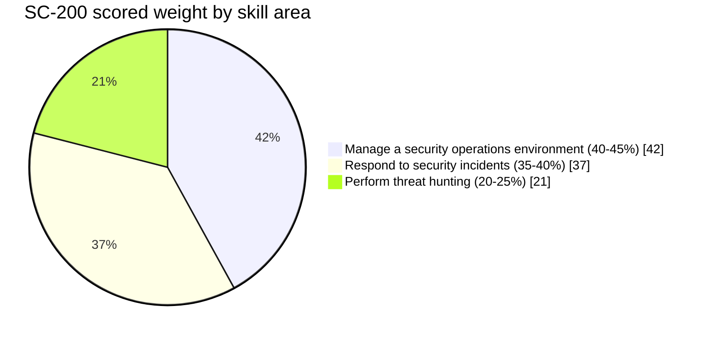
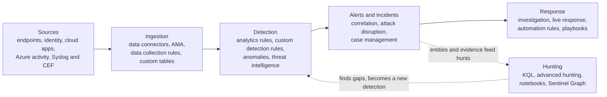

# SC-200: Microsoft Security Operations Analyst

A practice-first study kit for Exam SC-200, the exam behind the Microsoft Certified: Security Operations Analyst Associate credential. The kit assumes access to a lab tenant with security licensing, because the exam rewards people who have actually clicked through the portals rather than only read about them.

## Exam facts at a glance

| Attribute | Detail |
| --- | --- |
| Exam code | SC-200 |
| Credential | Microsoft Certified: Security Operations Analyst Associate |
| Level | Intermediate |
| Maintained by | Microsoft, delivered through Pearson VUE |
| Format | Proctored, multiple choice and scenario based, may include case studies |
| Question count | Approximately 40 to 60 |
| Duration | Approximately 120 minutes |
| Passing score | 700 out of 1000 |
| Language | English, with other languages released later |
| Skills measured as of | 16 April 2026 |
| Scheduling | A personal Microsoft account is worth using, so the record survives a change of employer |

## What the exam measures

The exam is split into three skill areas. The percentages are the published share of scored questions, which is what drives how the sprint plan allocates time.

## The mental model

Almost every question sits somewhere on a single path: telemetry is collected from a source, it is ingested and normalised, a detection turns it into an alert, alerts correlate into an incident, an analyst responds, and hunting looks for what the detections missed. Knowing where a given feature sits on that path answers most scenario questions faster than recalling the feature in isolation.

Domain 1 owns the left of the diagram, from sources through detection. Domain 2 owns incidents and response. Domain 3 owns the hunting loop that feeds back into detection. Kusto Query Language cuts across all three, which is why the plan practises it every single day rather than treating it as one topic.

## How to use this kit

Read the plan first to fix the sequence, then work the domain deep-dives one at a time. Each domain page ends with lab exercises meant to be executed in a lab tenant, not merely read. The practice page is for spaced recall once a domain is covered.

## Pages in this kit

| Page | Purpose |
| --- | --- |
| [Sprint plan]({{ site.baseurl }}/sc-200-security-operations/plan/) | A day-by-day plan weighted to the scored skill areas, numbered so it fits any exam date |
| [Domain deep-dives]({{ site.baseurl }}/sc-200-security-operations/domains/) | Each of the three skill areas explained with a diagram, the measured skills, and hands-on labs |
| [Practice and flashcards]({{ site.baseurl }}/sc-200-security-operations/practice/) | A self-test bank organised by domain, plus rapid-recall flashcards and KQL drills |
| [Resources]({{ site.baseurl }}/sc-200-security-operations/resources/) | Official study guide, product documentation, and vetted community sources |
