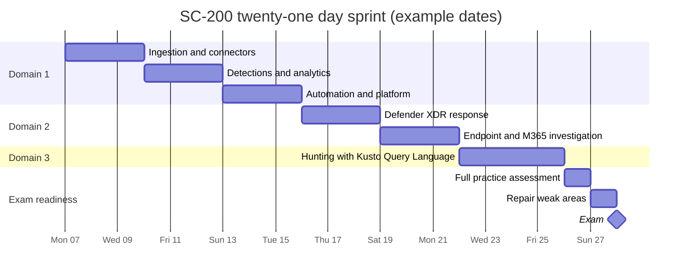

# Sprint plan

A twenty-one day plan that assumes roughly one to two hours on weekdays and a longer block on each weekend. The sequencing rule matches the other kits in this collection: hours follow exam weight, and the heaviest area gets the largest block. Days are numbered rather than dated, so the plan works from any start date. Count backwards from the exam sitting, so that Day 21 lands on the day before the exam.

## How the time is allocated

| Skill area | Exam weight | Days allocated | Why |
| --- | --- | --- | --- |
| Manage a security operations environment | 40 to 45 percent | 9 | Heaviest area, and the widest surface: ingestion, connectors, retention, detections, and automation |
| Respond to security incidents | 35 to 40 percent | 6 | Large but narrower, and much of it is portal muscle memory built in the labs |
| Perform threat hunting | 20 to 25 percent | 4 | Smallest area by weight, but Kusto Query Language practice is spread across all twenty-one days |
| Consolidation | Not applicable | 2 | Full practice assessments and targeted repair of weak areas |

## How the sprint is shaped

The dates below are an illustrative three weeks starting on a Monday. Substitute the real dates for the chosen sitting, keeping the same shape, so the practice assessment still lands two days before the exam.

## Daily rhythm

Every study day follows the same four steps. The order matters: reading before doing wastes the lab, and quizzing before reviewing hides the gaps.

1. Read the relevant Microsoft Learn module for the topic.
2. Execute the matching lab in a lab tenant. Clicking the path once beats reading it three times.
3. Answer five to ten recall questions on the topic from the practice page.
4. Note every weak area in a running list. That list becomes the Day 20 and 21 agenda.

## Days 1 to 9: manage a security operations environment

| Day | Focus | Lab |
| --- | --- | --- |
| 1 | Data connectors and source selection: which connector for which source | Lab 1.3, steps 1 and 2 |
| 2 | Windows security events via the Azure Monitor Agent, and data collection rules | Lab 1.3, step 2 |
| 3 | Syslog and CEF via the agent, Azure activity collection, custom log tables, threat indicators | Lab 1.3, steps 3 to 6 |
| 4 | Analytics rules: scheduled, near real time, threat intelligence, and machine learning | Lab 1.4, steps 4 and 5 |
| 5 | Custom detection rules through advanced hunting, and rule management | Lab 1.4, steps 1 to 3 |
| 6 | MITRE ATT&CK coverage analysis and anomaly configuration | Lab 1.4, steps 6 and 7 |
| 7 | Defender XDR automation: notifications, automated investigation, attack disruption | Lab 1.1 |
| 8 | Endpoint configuration: advanced features, rules, custom data collection, attack surface reduction, device groups | Lab 1.1, steps 3 to 5 |
| 9 | Sentinel platform: roles, retention tiers, workbooks, SOC optimisation, automation rules and playbooks | Lab 1.2 |

## Days 10 to 15: respond to security incidents

| Day | Focus | Lab |
| --- | --- | --- |
| 10 | Incident triage in Defender XDR: the incident graph, entities, evidence, classification | Lab 2.1, steps 1 and 2 |
| 11 | Cross-product investigation: Defender for Office 365, for Cloud, for Cloud Apps, for Identity, and Entra ID | Lab 2.1, step 3 |
| 12 | Multi-stage attacks, incident linking, case management, and agentic investigation assistance | Lab 2.1, steps 4 and 5 |
| 13 | Defender for Endpoint: device timelines, live response, investigation packages | Lab 2.2 |
| 14 | Purview investigation: Audit and Content Search | Lab 2.3, steps 1 and 2 |
| 15 | Microsoft Graph activity logs, and reviewing automated investigation outcomes | Lab 2.3, step 3 |

## Days 16 to 19: perform threat hunting

| Day | Focus | Lab |
| --- | --- | --- |
| 16 | Table selection: knowing which table holds which signal is half the domain | Lab 3.1, query 1 |
| 17 | Advanced hunting query construction, and interpreting threat analytics | Lab 3.1, queries 2 and 3 |
| 18 | Hunting graphs, blast radius, and entity relationships in Sentinel Graph | Lab 3.1, steps 4 and 5 |
| 19 | Sentinel hunting: saved queries, bookmarks, data lake jobs, summary rules, notebooks | Lab 3.2 |

## Days 20 and 21: consolidation

| Day | Focus |
| --- | --- |
| 20 | Full official practice assessment under timed conditions. Score by domain, not overall, so the weak domain is obvious. |
| 21 | Repair only. Work the weak-area list from the previous twenty days and re-run the practice assessment. Do not learn anything new on the final day. |

## Readiness check before booking

Do not sit the exam until all four of these are true.

1. The official practice assessment scores above 80 percent, twice, on different days.
2. No single domain scores below 70 percent in isolation.
3. Every lab in the domain pages has been executed at least once, end to end.
4. A Kusto query can be written from a blank editor to answer a plain-language question, without copying an example.
